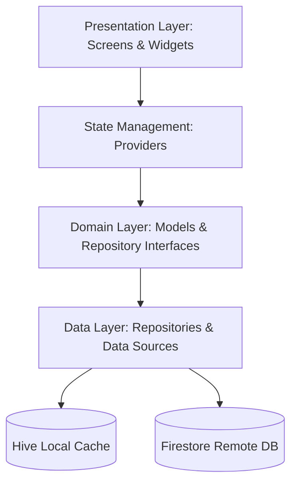

# 📋 ROCIs Tasks

**ROCIs Tasks** is a premium, feature-rich task management application built with Flutter. Combining robust task tracking with seamless Google Calendar integration, real-time local-cloud synchronization, and native Android home screen widgets, the app offers an ultra-modern workspace to keep users organized and productive.

<div align="center">

[](https://rocis-todo.web.app)
[](https://play.google.com/store/apps/details?id=com.rocisapps.tasks)

</div>

---

## ✨ Key Features

### 🔐 Multi-Tiered Authentication

- **Primary Auth**: Seamless, secure Google Sign-In.
- **Secondary Credentials**: Custom Email & Password Sign-up, Sign-in, and Password Reset flows.
- **Session Persistence**: Managed securely with `AuthService` to persist sessions across launches.

### ✅ Task & Category Management

- **Full CRUD Support**: Create, read, update, and soft-delete tasks.
- **Priority Classes**: Dynamic visual signaling for High, Medium, and Low priorities.
- **Subtasks & Checklists**: Nest checklists within tasks for granular breakdown.
- **Task Attachments**: Upload and associate files/images with tasks (Firebase Storage).
- **Recurrence**: Standard rule-based recurring tasks (via `rrule`).
- **Local Cache & Sync**: Instant access via **Hive** with background sync to **Firebase Firestore** (offline-first support).
- **Soft-Deletion Bin**: Restore deleted tasks easily.

### 📅 Unified Calendar View

- **Integrated Agenda**: Built using `table_calendar` to display events and tasks side-by-side.
- **On-Device Sync**: Integrates with local device calendars using `device_calendar` to render external calendar events.
- **Activity Badges**: Color-coded markers for days containing tasks or external events.

### 📊 Productivity Analytics & Insights

- **Completion Trends**: Visualized last 7 days metrics (via `fl_chart`).
- **Category Balancing**: Pie charts illustrating effort distribution across different work spheres.

### 📱 Android Home Screen Widgets

- **Interactive Action**: View, filter, and mark tasks complete directly from the home screen.
- **Native State Offset**: Calendar navigation offsets (Prev/Next/Today) are calculated and persisted natively on the Android side (Kotlin) before notifying the Dart background handler, eliminating synchronization lag and double-incrementing states.

### 🎨 Premium Glassmorphism UI/UX

- **Visual Design**: Elegant frosted glass cards and dialogs using `GlassContainer` with custom category borders and opacity blends.
- **Dynamic Theming**: Android Material You wallpaper-derived themes (via `dynamic_color`).
- **System Default Mode**: Automatic transitions between Dark and Light mode.
- **Satisfying Haptics**: Satisfying medium/light haptic pulses on completing/uncompleting tasks.
- **Bouncy Easter Eggs**: Fun interaction animations on FAB double-taps/long-presses.

### 💰 Subscription Gating (PRO)

- **RevenueCat Integration**: App Store / Play Store subscription flows with `purchases_flutter` and `purchases_ui_flutter`.
- **PRO Lockouts**: Visual premium badges and paywalls for recurring tasks, attachments, unlimited categories, and widgets.

---

## 🏗️ Clean Architecture

The app is built following a **Feature-First Clean Architecture** system to maintain a decoupled codebase:



### File Hierarchy

```plaintext
lib/
├── core/
│   ├── config/        # Environment configurations (AppConfig, Router)
│   ├── models/        # Shared system models
│   ├── services/      # Global infrastructure (Auth, Sync, Timezone, Security, RevenueCat)
│   └── theme/         # UI tokens and dynamic theme providers
├── features/
│   ├── auth/          # Authentication screens and providers
│   ├── calendar/      # Calendar rendering and device-calendar sync
│   ├── categories/    # Category CRUD and gating limits
│   ├── home/          # Shell and bottom navigation layouts
│   ├── onboarding/    # Multi-pane sliding tutorial carousel
│   ├── premium/       # Paywall views and PRO locks
│   └── tasks/         # Tasks CRUD, details, checklists, attachments
├── l10n/              # ARB file translation templates (EN, HE, ES)
└── main.dart          # Application initialization root
```

---

## 🚀 Getting Started

### Prerequisites

- **Flutter SDK** (`^3.10.0`)
- **Android SDK** (API Level 21+) / **iOS SDK** (iOS 13.0+)
- **Firebase Project** containing Auth, Firestore, Analytics, and Crashlytics.

### Setup & Installation

1. **Clone the repository**:

   ```bash
   git clone https://github.com/yourusername/rocis-tasks.git
   cd rocis-tasks
   ```

2. **Retrieve Dependencies**:

   ```bash
   flutter pub get
   ```

3. **Initialize Configuration Templates**:

   ```bash
   cp .env.example .env
   cp lib/firebase_options.dart.example lib/firebase_options.dart
   cp lib/firebase_schedule_options.dart.example lib/firebase_schedule_options.dart
   ```

   _Note: Populate `.env` with your RevenueCat and App Config environment variables._

4. **Generate Hive Code Adapters**:

   ```bash
   dart run build_runner build --delete-conflicting-outputs
   ```

5. **Register Firebase (via FlutterFire CLI)**:
   ```bash
   flutterfire configure
   ```

---

## 🧪 Testing & Validation

Run unit and widget tests:

```bash
flutter test
```

### Master Validation Scripts (Antigravity Kit)

The repository contains built-in automated scripts to ensure compliance with quality, security, and styling guidelines:

```bash
# Run incremental validation (Security, Lint, Schema, Tests, UX, SEO)
python .agent/scripts/checklist.py .

# Run comprehensive release checks (Checklist + Lighthouse, E2E, Mobile Audit)
python .agent/scripts/verify_all.py . --url <local-dev-server-url>
```

---

## 📄 License & Documentation

- **License**: Licensed under the [MIT License](LICENSE).
- **Setup Details**: Refer to [docs/SETUP.md](docs/SETUP.md) for full backend configuration details.
- **Architectural Guidelines**: Refer to [docs/ARCHITECTURE.md](docs/ARCHITECTURE.md) and [.agent/rules/AGENTS.md](.agent/rules/AGENTS.md).
- **Latest Changes**: Review [docs/CHANGELOG.md](docs/CHANGELOG.md) for release records.
