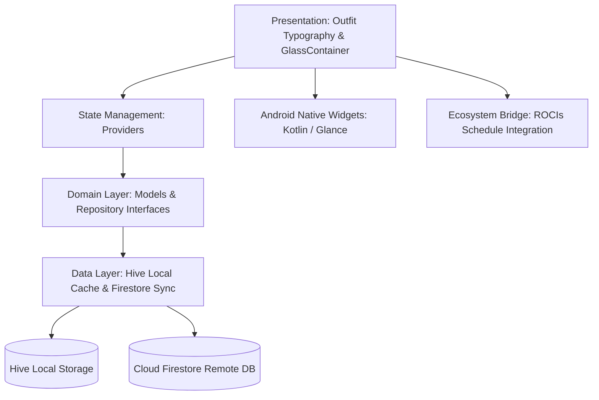

<div align="center">

  

  # 📋 ROCIs Tasks
  **The Next-Generation Task & Calendar Workspace for Android**

  [](https://flutter.dev)
  [](https://dart.dev)
  []()
  []()
  [](https://play.google.com/store/apps/details?id=com.rocisapps.tasks)
  [](https://tasks.rocisapps.com)
  []()
  [](LICENSE)

  <br />

  

</div>

---

## 🌟 Overview

**ROCIs Tasks** is an offline-first productivity and workload management application built with Flutter. Engineered according to ROCI's Design System, it seamlessly unifies smart natural language task creation, Google Calendar synchronization, on-device calendar integration, interactive Android home screen widgets, and real-time local-cloud database synchronization.

---

## ✨ Features

- ⚡ **Zero-Friction Natural Language Task Input:**
  - Fast typing parser: type *"Submit research essay tomorrow at 5pm #urgent @school"* to auto-configure dates, times, priority levels, and category tags with zero manual dropdown navigation.
  - Quick-date chips for instant rescheduling (*Today*, *Tomorrow*, *This Weekend*, *Next Week*).

- 📱 **Interactive Android Home Screen Widgets:**
  - View focus agendas, check off completed tasks, and browse monthly calendar views directly from the home launcher.
  - Native Kotlin offset persistence eliminates synchronization lag and prevents double-incrementing navigation states before notifying the Dart background isolate.

- 📅 **Unified Calendar & Device Sync:**
  - Side-by-side agenda displaying tasks, Google Calendar events, and local device calendars via `table_calendar` and `device_calendar`.
  - Color-coded category markers for rapid glanceability across complex schedules.

- 📋 **Nested Subtasks, Checklists & Attachments:**
  - Break down daunting projects into granular subtask checklists with live progress tracking.
  - Attach images, study notes, and PDF references directly to tasks via Cloud Storage.
  - Flexible rule-based task recurrence (daily, weekly, monthly, custom intervals via `rrule`).

- 📊 **Productivity Analytics & Visual Streaks:**
  - 7-day completion velocity charts and category effort balancing powered by `fl_chart`.
  - Motivating milestone streaks and completion summaries.

- 🌙 **True AMOLED Pitch-Black Mode & Glassmorphism:**
  - Battery-saving pure black mode (`#000000`) and Material You dynamic color adaptation.
  - Frosted glass cards and dialogs (`GlassContainer`) with 10–18% category tint borders.
  - Satisfying micro-haptic tactile feedback on completing tasks and playful UI easter eggs.

- 🔄 **Offline-First Synchronization:**
  - Instant local read/write access via **Hive** local cache.
  - Effortless background syncing with **Firebase Firestore** whenever internet connectivity is restored.

- 🌉 **ROCIs Ecosystem Synergy:**
  - Inter-app bridge support for **ROCIs Schedule** via deep linking (`roci-tasks://create-task`), allowing direct assignment and exam export from course schedules into your task workflow.

---

## 📸 Screenshots

<div align="center">
  <table>
    <tr>
      <td width="33%"></td>
      <td width="33%"></td>
      <td width="33%"></td>
    </tr>
    <tr>
      <td align="center"><b>Daily Focus Agenda</b></td>
      <td align="center"><b>Natural Language Input</b></td>
      <td align="center"><b>Android Home Widgets</b></td>
    </tr>
    <tr>
      <td width="33%"></td>
      <td width="33%"></td>
      <td width="33%"></td>
    </tr>
    <tr>
      <td align="center"><b>Unified Calendar Sync</b></td>
      <td align="center"><b>Subtasks & Attachments</b></td>
      <td align="center"><b>Productivity Analytics</b></td>
    </tr>
  </table>
</div>

---

## 🛠️ Architecture & Tech Stack



- **Framework:** Flutter 3.x / Dart 3.x
- **Architecture:** Feature-First Clean Architecture
- **State Management:** `provider`
- **Local Persistence:** `hive` & `shared_preferences` (Offline-first architecture)
- **Cloud Backend:** Firebase Auth, Cloud Firestore, Firebase Storage, Crashlytics & Analytics
- **Calendar & Time:** `table_calendar`, `device_calendar`, `timezone`, `rrule`
- **UI & Theming:** Google Fonts `Outfit`, `GlassContainer`, Material You `dynamic_color`
- **Monetization:** `purchases_flutter` (RevenueCat SDK)
- **Quality & Testing:** 42 test suites with automated Antigravity validation scripts

---

## 🚀 Getting Started

### Prerequisites

- [Flutter SDK](https://docs.flutter.dev/get-started/install) (version `>= 3.10.0`)
- [Android Studio](https://developer.android.com/studio) or VS Code with Flutter extension
- Android SDK (API Level 21+) / Java JDK 17+
- Configured Firebase Project (Auth, Firestore, Storage)

### Installation & Run

```bash
# Clone the repository
git clone https://github.com/RoeeIlouz/ROCIs-tasks.git
cd ROCIs-tasks

# Retrieve dependencies
flutter pub get

# Initialize environment configuration templates
cp .env.example .env
cp lib/firebase_options.dart.example lib/firebase_options.dart
cp lib/firebase_schedule_options.dart.example lib/firebase_schedule_options.dart

# Generate Hive type adapters
dart run build_runner build --delete-conflicting-outputs

# Run static analysis
flutter analyze

# Run all test suites
flutter test

# Launch the app in debug mode
flutter run
```

### Build Release APK

```bash
# Build standalone release APK
flutter build apk --release

# The compiled APK is generated at:
# build/app/outputs/flutter-apk/app-release.apk
```

---

## 📄 License & Documentation

- **License:** Licensed under the [MIT License](LICENSE).
- **Backend Setup:** Refer to [docs/SETUP.md](docs/SETUP.md) for full Firebase & RevenueCat instructions.
- **Architectural Guidelines:** Refer to [docs/ARCHITECTURE.md](docs/ARCHITECTURE.md).
- **Release History:** Review [docs/CHANGELOG.md](docs/CHANGELOG.md) for updates.
