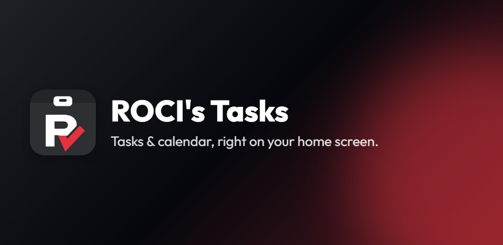
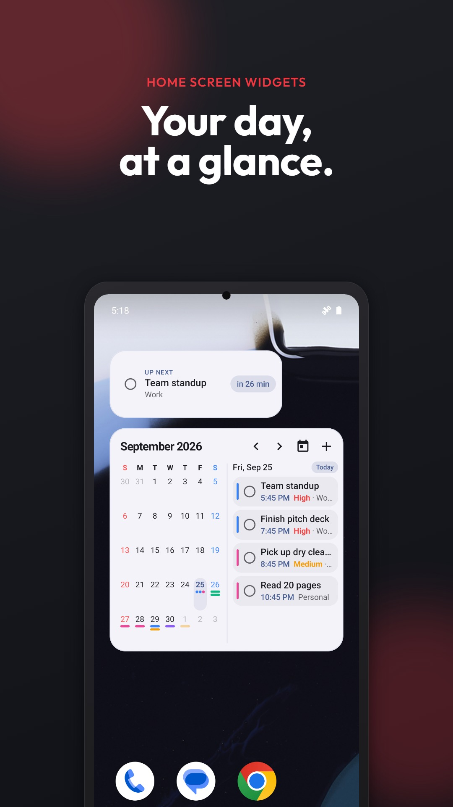
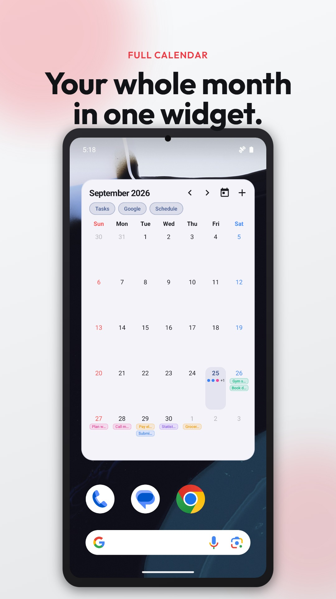
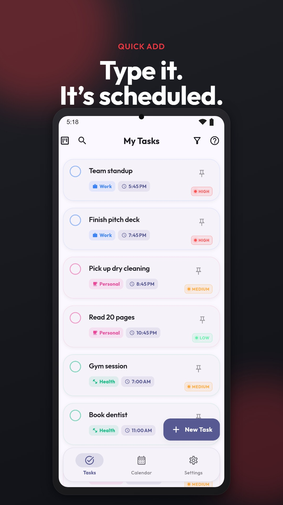
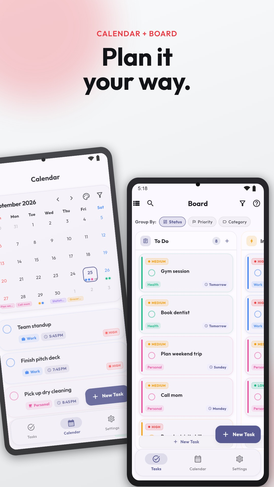
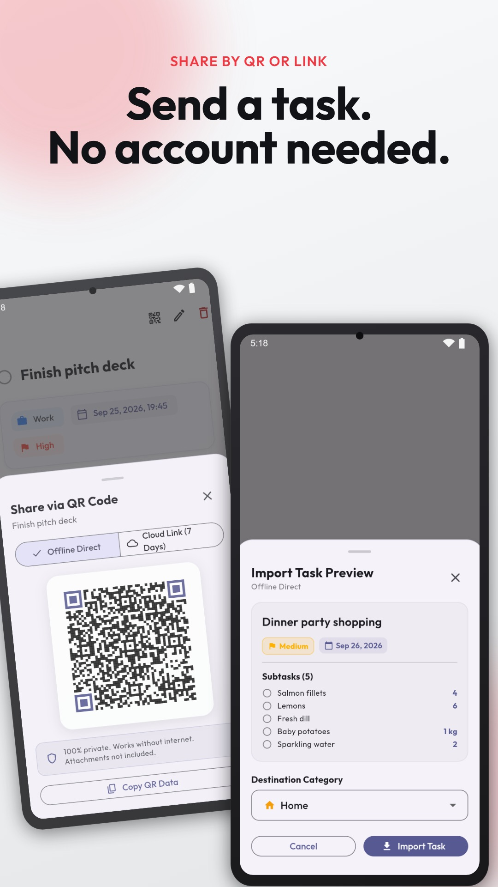
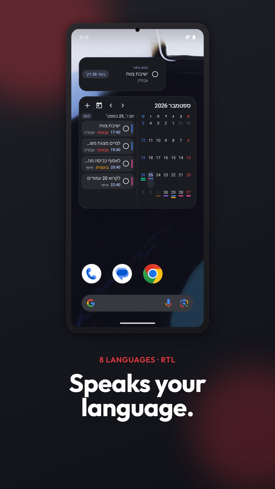

<div align="center">

  

  # ROCIs Tasks
  **Tasks and your calendar on one timeline. Type a task the way you would say it.**

  [](https://flutter.dev)
  [](https://dart.dev)
  [](https://github.com/RoeeIlouz/ROCIsTasks-Public/actions/workflows/flutter-ci.yml)
  [](https://play.google.com/store/apps/details?id=com.rocisapps.tasks)
  [](https://tasks.rocisapps.com)
  []()
  [](LICENSE)

  <br />

  

</div>

---

Get it on [Google Play](https://play.google.com/store/apps/details?id=com.rocisapps.tasks) or use the [web version](https://tasks.rocisapps.com).

## What it does

- **Natural language input.** Type `Submit essay tomorrow at 5pm #urgent @school` and the date, time, priority and category are filled in for you.
- **One timeline.** Tasks, Google Calendar events and your phone's calendars side by side.
- **Home screen widgets** for today's agenda and a month view, with tasks you can check off without opening the app.
- **Subtasks, checklists and repeating tasks** (daily, weekly, monthly or custom rules).
- **Insights**: a 7-day completion chart, streaks and a per-category balance.
- **Works offline** and syncs when you are back online.
- **Pairs with [ROCIs Schedule](https://github.com/RoeeIlouz/ROCIs-Schedule)**: send an assignment or exam from your timetable straight into Tasks.

## Screenshots

<div align="center">
  <table>
    <tr>
      <td width="33%"></td>
      <td width="33%"></td>
      <td width="33%"></td>
    </tr>
    <tr>
      <td align="center"><b>Home Screen Widgets</b></td>
      <td align="center"><b>Full Calendar Widget</b></td>
      <td align="center"><b>Quick Add</b></td>
    </tr>
    <tr>
      <td width="33%"></td>
      <td width="33%"></td>
      <td width="33%"></td>
    </tr>
    <tr>
      <td align="center"><b>Calendar + Board</b></td>
      <td align="center"><b>Share by QR or Link</b></td>
      <td align="center"><b>8 Languages + RTL</b></td>
    </tr>
  </table>
</div>

## How it works

- **Local first.** Tasks live in Hive on the device, so reads and writes are instant and nothing waits on the network.
- **Sync.** When signed in, changes are pushed to Cloud Firestore and pulled on other devices. Security rules scope every document to its owner. QR "Cloud Link" shares are short-lived snapshots that can be opened by ID but never listed.
- **Widgets** are native Android views fed from the Dart side through `home_widget`, so they update without the app running.
- **Releases** go through GitHub Actions to Google Play. Dart-only fixes ship as Shorebird patches, without a store review.

**Stack:** Flutter, Dart 3, Provider, go_router, Hive CE, Firebase (Auth, Firestore, Crashlytics, Analytics, Remote Config), RevenueCat, Shorebird.

## Run it locally

```bash
git clone https://github.com/RoeeIlouz/ROCIsTasks-Public.git
cd ROCIsTasks-Public
flutter pub get
cp .env.example .env
cp lib/firebase_options.dart.example lib/firebase_options.dart
cp lib/firebase_schedule_options.dart.example lib/firebase_schedule_options.dart
dart run build_runner build --delete-conflicting-outputs
flutter analyze
flutter test
flutter run
```

Firebase and RevenueCat setup is in [docs/SETUP.md](docs/SETUP.md). Architecture notes are in [docs/ARCHITECTURE.md](docs/ARCHITECTURE.md), and the release history in [docs/CHANGELOG.md](docs/CHANGELOG.md).

## License

MIT. See [LICENSE](LICENSE).
