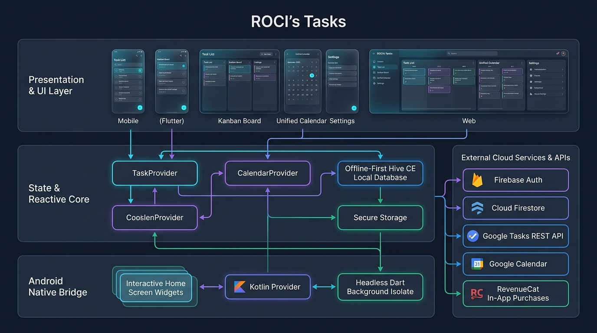
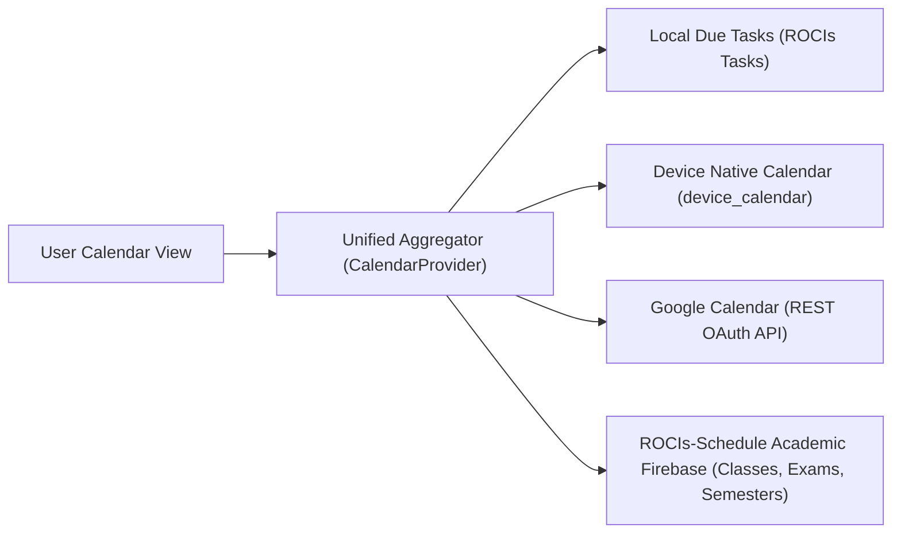
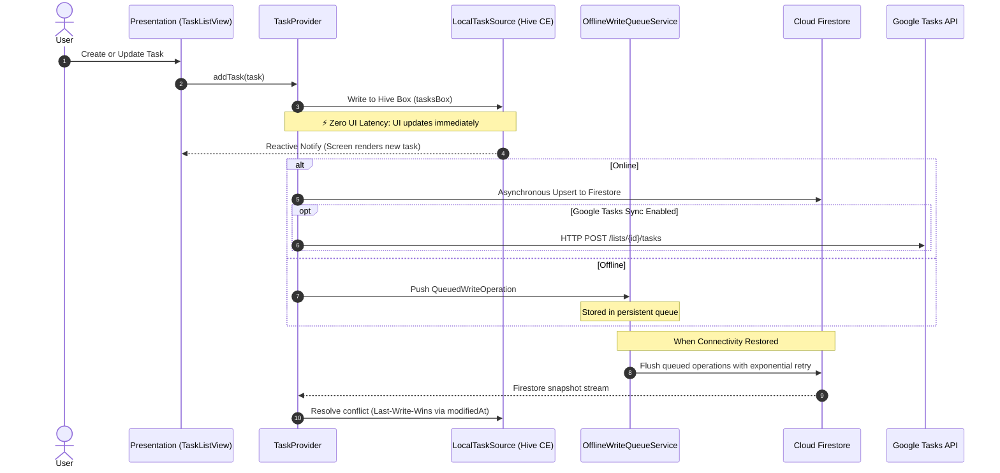
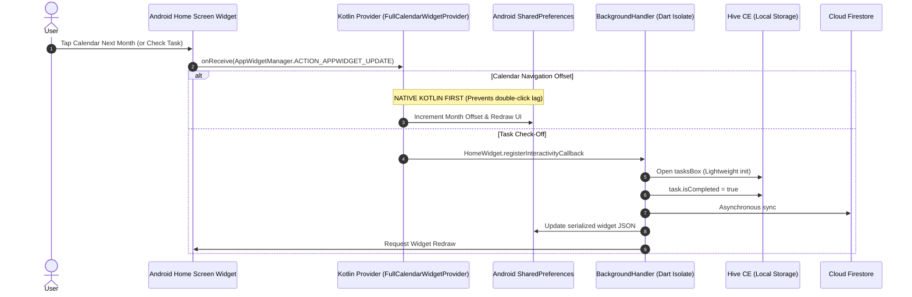
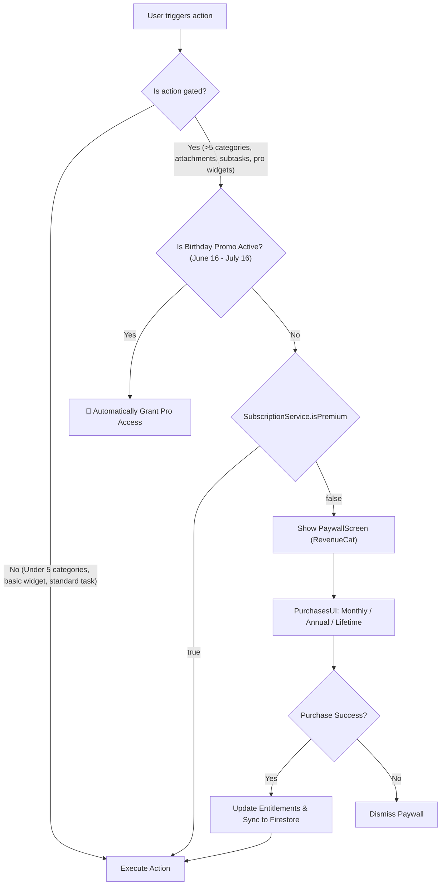
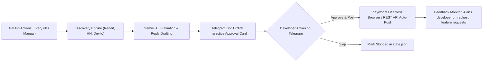

# 🏛️ Complete System Architecture & Feature Blueprint: ROCIs Tasks

This document maps the entire ecosystem of **ROCIs Tasks** — detailing every layer, feature, external API, local database, background isolate, Android native widget, security mechanism, and autonomous subsystem.

---

## 1. High-Level System Architecture

```mermaid
flowchart TB
    subgraph PRESENTATION["Presentation Layer (Flutter / Web)"]
        UI_HOME["HomeScreen (Responsive: Mobile PageView / Web Split-View)"]
        UI_TASKS["TaskListView / KanbanBoardView / AddTaskScreen / DetailScreen"]
        UI_CALENDAR["CalendarScreen (table_calendar Unified Agenda)"]
        UI_CATS["CategoriesScreen (CRUD, Limit Gated, Private Flag)"]
        UI_SETTINGS["SettingsScreen (Theming, AMOLED, Vault PIN, Backup)"]
        UI_PREMIUM["PaywallScreen (RevenueCat / Birthday Promo Override)"]
        UI_GLASS["Shared UI Kit (GlassContainer, Material You Dynamic Color)"]
    end

    subgraph PROVIDERS["State Management (Provider / ChangeNotifier)"]
        P_TASK["TaskProvider (Task CRUD, Filters, Selection, Sorting)"]
        P_CAL["CalendarProvider (Agenda, Selected Date, Range Filtering)"]
        P_AUTH["AuthService (Google Sign-In, Email/Password, User State)"]
        P_SUB["SubscriptionService (RevenueCat Pro Entitlement, Web Sync)"]
        P_THEME["ThemeService (Light, Dark, AMOLED, Dynamic Material You)"]
        P_PRIV["PrivateModeService (Biometric / PIN Security Vault)"]
        P_CONN["ConnectivityService (Online/Offline State Stream)"]
    end

    subgraph DATA_CORE["Core & Data Layer (Offline-First)"]
        LOCAL_SRC["LocalTaskSource (Hive CE Boxes: tasksBox, categoriesBox, settings)"]
        QUEUE["OfflineWriteQueueService (Exponential Backoff, Retries)"]
        LWW["ConflictResolutionService (Last-Write-Wins via modifiedAt)"]
        CACHE["CacheService & SharedPreferences"]
        SECURE_STORE["FlutterSecureStorage & EncryptionService (AES-256)"]
    end

    subgraph EXTERNAL_APIS["Cloud Services & External APIs"]
        FIREBASE_AUTH["Firebase Auth (Google, Email/Password)"]
        FIRESTORE_MAIN["Cloud Firestore (Main tasks & categories sync)"]
        FIREBASE_SEC["ROCIs-Schedule Secondary Firestore (Academic Classes/Exams)"]
        FIREBASE_STORAGE["Firebase Storage (Task Attachments & Media)"]
        GOOGLE_TASKS["Google Tasks REST API (v1 /users/@me/lists)"]
        GOOGLE_CALENDAR["Google Calendar REST API & Native device_calendar"]
        REVENUE_CAT["RevenueCat Purchases API (Google Play / App Store)"]
        FIREBASE_OBS["Firebase Crashlytics, Analytics & Performance Traces"]
    end

    subgraph PLATFORM["OS & Hardware Bridge"]
        KOTLIN_WIDGETS["Android Native Kotlin Providers (FullCalendar, Kanban, Agenda, Task)"]
        BG_ISOLATE["BackgroundHandler (Headless Dart Isolate for Widget Clicks)"]
        LOCAL_NOTIF["flutter_local_notifications (Scheduled Reminders, Snooze)"]
        BIOMETRICS["local_auth (Fingerprint / Face ID)"]
    end

    PRESENTATION --> PROVIDERS
    PROVIDERS --> DATA_CORE
    DATA_CORE --> EXTERNAL_APIS
    DATA_CORE --> PLATFORM
    PLATFORM <--> DATA_CORE
```

---

## 2. Core Feature Breakdown

### A. Task Engine & Organization
- **Data Model**:
  - `id`, `title`, `description`, `priority` (Low, Medium, High).
  - `dueDate`, `isCompleted`, `completedAt`, `createdAt`, `modifiedAt`.
  - `categoryIds` (Multi-category association), `isPinned` (Top pinning).
  - `isDeleted` (Soft delete / Recycle Bin recovery flow).
  - `recurrenceRule` (iCal `rrule` syntax: Daily, Weekly, Monthly, Interval).
  - `subTasks` (Hierarchical checklists with completion ratio calculation).
  - `attachmentPaths` (Local & Cloud Firestore image/document attachments).
  - `customFields` (Typed: `contact`, `location`, `url`, `text`).
  - `isGroceryList` (Optimized rapid checking format).
- **Views**:
  - **Standard List**: Grouped by date (Overdue, Today, Tomorrow, Upcoming), category badges.
  - **Kanban Board**: Drag-and-drop columns (*To Do*, *In Progress*, *Done*).
  - **Multi-Selection Mode**: Batch pin, category assign, complete, or delete.
  - **Recycle Bin**: Soft-deleted tasks preserved until manually cleared or restored.

### B. Unified Calendar & Cross-App Schedule Sync

- **Unified Day Cells**: Colored indicator dots differentiating tasks, external meetings, and academic courses.
- **Academic Semester Rules**: Automatic date boundary filtering (e.g. Israeli university calendar semesters) to suppress recurring classes during vacations.

### C. Private Security Vault (Private Mode)
- **Privacy Gating**: Categories can be flagged as `isPrivate = true`.
- **Hiding Logic**: Tasks belonging to private categories disappear completely from list, calendar, and search.
- **Biometric & PIN Authentication**: Protected via `local_auth` and AES-256 keys held in `FlutterSecureStorage`.
- **Auto-Lock**: Re-locks instantly upon app pause or background transition.

### D. Theming & Glassmorphism System
- **Frosted Glass Container**: Dynamic blur (`BackdropFilter`) with alpha tinting (12% light mode, 18% dark mode).
- **Material You Dynamic Colors**: Wallpaper color extraction via Android `dynamic_color`.
- **AMOLED Mode**: Pitch black (#000000) for OLED battery preservation.
- **Micro-Interactions**: Haptic pulses on completion; bouncy easter-egg spinners on FAB long press.

---

## 3. Data Flow & Offline-First Synchronization

---

## 4. Android Home Screen Widget & Native Kotlin Bridge

ROCIs Tasks features interactive home screen widgets where clicking a checkbox updates the task without opening the app:

### Available Android Widgets:
1. `FullCalendarWidgetProvider`: Interactive monthly calendar grid with native month shifting.
2. `TaskWidgetProvider`: Interactive check-off list of pending tasks.
3. `KanbanWidgetProvider`: Overview of columns (*To Do*, *In Progress*, *Done*).
4. `MonthAgendaWidgetProvider`: Monthly calendar combined with the day's agenda.
5. `TimelineAgendaWidgetProvider`: Hourly breakdown of schedule and events.
6. `TodayAgendaWidgetProvider`: High-priority tasks and calendar events due today.
7. `UpNextWidgetProvider`: Imminent upcoming deadlines and meetings.
8. `QuickActionWidgetProvider`: 1-tap shortcut to open the Smart Add sheet.

---

## 5. Monetization & Paywall Lifecycle

---

## 6. Autonomous Marketing & Community Intelligence Bot

Located under `scripts/marketing_bot/`, this system automates organic promotion and user feedback loops:

